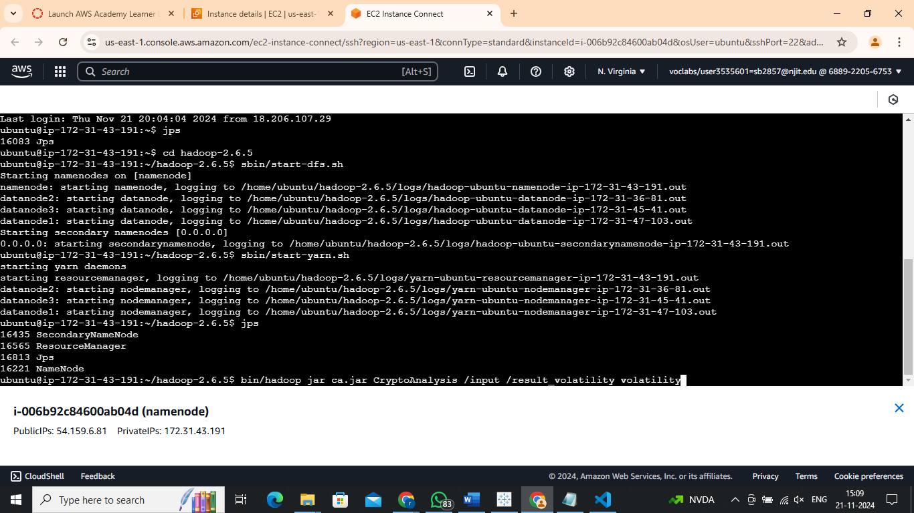
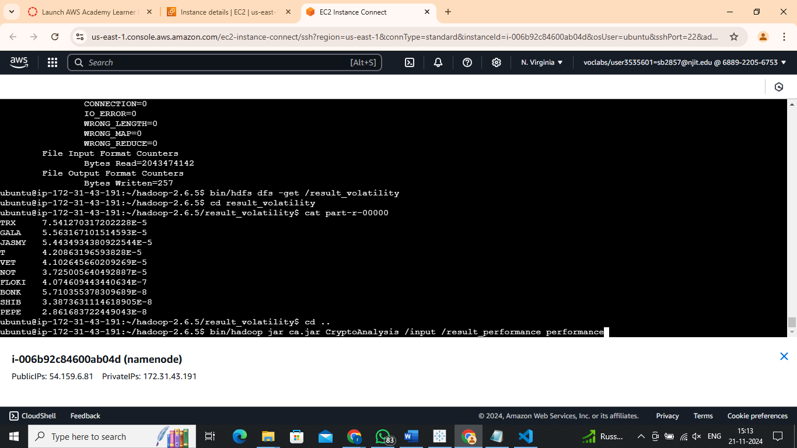
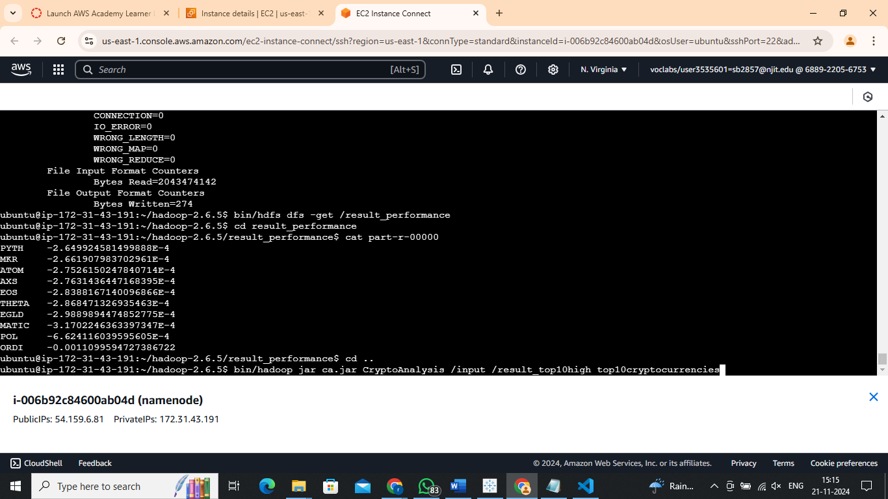
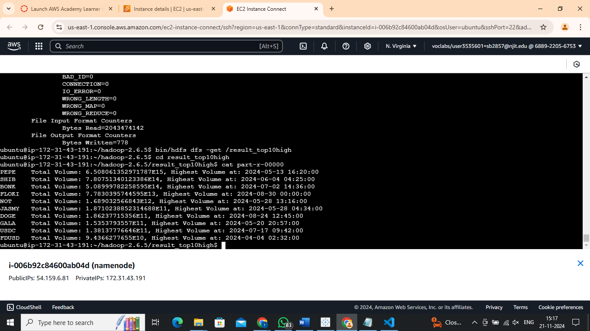

# Cryptocurrency Market Analysis with Apache Hadoop MapReduce

A distributed big data processing system for analyzing large-scale cryptocurrency market data. Built with Apache Hadoop MapReduce and deployed on a multi-node AWS EC2 cluster, this project processes millions of OHLCV trading records to surface volatility patterns, performance metrics, and peak volume events across major cryptocurrencies.

---

## Overview

Raw cryptocurrency tick data holds signals that are invisible at small scale. This project builds a three-job MapReduce pipeline that ingests historical OHLCV data from HDFS, parallelizes the computation across a Hadoop cluster, and produces ranked analytics for three distinct dimensions: price volatility, open-to-close performance, and cumulative trading volume.

The pipeline is designed to scale horizontally — adding nodes to the cluster increases throughput without any code changes.

---

## Features

| Job | What it computes |
|-----|-----------------|
| **Volatility** | Average intraday price spread (High − Low) per symbol; ranks the top 10 most volatile assets |
| **Performance** | Average open-to-close percentage change per symbol; identifies the strongest and weakest performers |
| **Volume Leaders** | Cumulative trading volume per symbol with peak-volume timestamp; surfaces the top 10 highest-volume assets |

---

## Architecture

```
Raw CSV Data (HDFS /input)
         │
         ▼
┌────────────────────────────────────────────────┐
│               MapReduce Pipeline               │
│                                                │
│  ┌─────────────────┐     ┌──────────────────┐  │
│  │     Mapper      │────▶│     Reducer      │  │
│  │  Parse CSV row  │     │  Aggregate per   │  │
│  │  Emit (symbol,  │     │  symbol, select  │  │
│  │   metric) pair  │     │  Top-K via PQ    │  │
│  └─────────────────┘     └──────────────────┘  │
└────────────────────────────────────────────────┘
         │
         ▼
Results written to HDFS → pulled to local via hdfs dfs -get
```

Each analysis job shares the same entry point (`CryptoAnalysis`) but routes to a different Mapper/Reducer pair based on the `<task>` argument. A `PriorityQueue` in the Reducer's `cleanup()` phase selects the global Top-10 after all records for a symbol are aggregated.

---

## Tech Stack

| Layer | Technology |
|-------|-----------|
| Processing framework | Apache Hadoop 2.6.5 (MapReduce) |
| Language | Java 8 |
| Distributed storage | HDFS |
| Infrastructure | AWS EC2 (namenode + datanodes) |
| Build | `javac` + `jar` |

---

## Dataset

Historical OHLCV tick data for 100+ cryptocurrency trading pairs spanning **April – August 2024**, sourced from Binance market data feeds (~2 GB loaded into HDFS).

**CSV schema (0-indexed columns):**

| Index | Field |
|-------|-------|
| 0 | Open price |
| 1 | High price |
| 2 | Low price |
| 3 | Close price |
| 4 | Volume |
| 6 | Unix timestamp |
| 8 | Symbol (e.g., BTCUSDT) |

---

## Results

### Volatility — Top 10 Most Volatile Cryptocurrencies

Average intraday High − Low price spread:

| Rank | Symbol | Avg Volatility |
|------|--------|----------------|
| 1 | TRX | 7.54 × 10⁻⁵ |
| 2 | GALA | 5.56 × 10⁻⁵ |
| 3 | JASMY | 5.44 × 10⁻⁵ |
| 4 | T | 4.21 × 10⁻⁵ |
| 5 | VET | 4.10 × 10⁻⁵ |
| 6 | NOT | 3.73 × 10⁻⁵ |
| 7 | FLOKI | 4.07 × 10⁻⁷ |
| 8 | BONK | 5.71 × 10⁻⁸ |
| 9 | SHIB | 3.39 × 10⁻⁸ |
| 10 | PEPE | 2.86 × 10⁻⁸ |

### Performance — Bottom 10 Avg Open→Close % Change

| Rank | Symbol | Avg % Change |
|------|--------|--------------|
| 1 | PYTH | −2.65 × 10⁻⁴ % |
| 2 | MKR | −2.66 × 10⁻⁴ % |
| 3 | ATOM | −2.75 × 10⁻⁴ % |
| 4 | AXS | −2.76 × 10⁻⁴ % |
| 5 | EOS | −2.84 × 10⁻⁴ % |
| 6 | THETA | −2.87 × 10⁻⁴ % |
| 7 | EGLD | −2.99 × 10⁻⁴ % |
| 8 | MATIC | −3.17 × 10⁻⁴ % |
| 9 | POL | −6.62 × 10⁻⁴ % |
| 10 | ORDI | −1.11 × 10⁻³ % |

### Top 10 by Volume — Highest Cumulative Trading Volume

| Rank | Symbol | Total Volume | Peak Volume Timestamp |
|------|--------|--------------|-----------------------|
| 1 | PEPE | 6.51 × 10¹⁵ | 2024-05-13 16:20:00 |
| 2 | SHIB | 7.81 × 10¹⁴ | 2024-06-04 04:25:00 |
| 3 | BONK | 5.09 × 10¹⁴ | 2024-07-02 14:36:00 |
| 4 | FLOKI | 7.78 × 10¹³ | 2024-08-30 00:00:00 |
| 5 | NOT | 1.69 × 10¹² | 2024-05-28 13:16:00 |
| 6 | JASMY | 1.87 × 10¹¹ | 2024-05-28 04:34:00 |
| 7 | DOGE | 1.86 × 10¹¹ | 2024-08-24 12:45:00 |
| 8 | GALA | 1.54 × 10¹¹ | 2024-05-20 20:57:00 |
| 9 | USDC | 1.38 × 10¹¹ | 2024-07-17 09:42:00 |
| 10 | FDUSD | 9.44 × 10¹⁰ | 2024-04-04 02:32:00 |

---

## Screenshots

### Hadoop Cluster — Job Submission & Execution


### Volatility Analysis — HDFS Output


### Performance Analysis — HDFS Output


### Top 10 by Volume — HDFS Output


---

## Setup & Usage

### Prerequisites

- Apache Hadoop 2.6.x installed and configured (HDFS + YARN)
- Java 8+
- HDFS namenode and at least one datanode running

### 1. Build from Source

```bash
# Compile
javac -classpath $(hadoop classpath) src/CryptoAnalysis.java -d out/

# Package
jar cf ca.jar -C out/ .
```

A pre-built JAR (`ca.jar`) is included in the repo root.

### 2. Load Data into HDFS

```bash
bin/hdfs dfs -mkdir /input
bin/hdfs dfs -put <path-to-csv-data> /input/
```

### 3. Run the Analysis Jobs

**Volatility:**
```bash
bin/hadoop jar ca.jar CryptoAnalysis /input /result_volatility volatility
```

**Performance:**
```bash
bin/hadoop jar ca.jar CryptoAnalysis /input /result_performance performance
```

**Top 10 by Volume:**
```bash
bin/hadoop jar ca.jar CryptoAnalysis /input /result_top10high top10cryptocurrencies
```

> If an output directory already exists in HDFS, the job deletes it automatically before writing.

### 4. Retrieve Results

```bash
bin/hdfs dfs -get /result_volatility
bin/hdfs dfs -get /result_performance
bin/hdfs dfs -get /result_top10high
```

Sample outputs are already committed under [`results/`](results/).

---

## Repository Structure

```
crypto-hadoop-analysis/
├── src/
│   └── CryptoAnalysis.java       # MapReduce source (3 jobs in one class)
├── screenshots/
│   ├── hadoop-cluster-execution.png
│   ├── volatility-output.png
│   ├── performance-output.png
│   └── top10-volume-output.png
├── results/
│   ├── result_volatility.txt
│   ├── result_performance.txt
│   └── result_top10high.txt
├── ca.jar                         # Pre-built executable JAR
└── README.md
```

---

## License

This project is licensed under the MIT License — see [LICENSE](LICENSE) for details.
